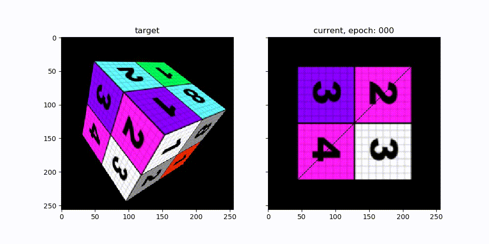

# DRender - a differentiable renderer

DRender is a simple triangle rasteriser written in pytorch.

## Install

    pip install -e .

## Requirements

    pytorch, torchvision, opencv-python

## Usage

See the [examples](./examples) directory
